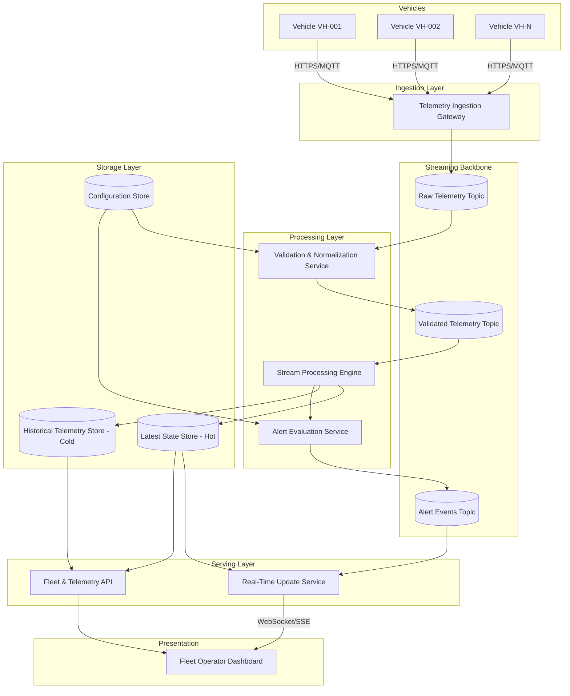
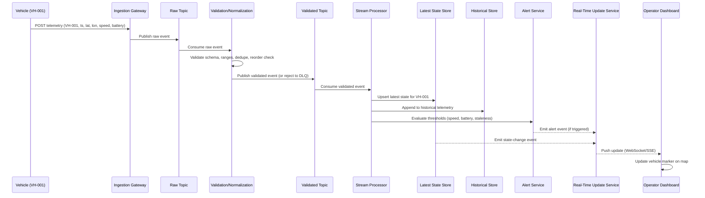

# Vehicle Telemetry & Fleet Visualization - Implementation Plan

## 1. Overview

This document defines the implementation plan for a **Vehicle Telemetry & Fleet Visualization Platform**. The system ingests periodic telemetry (GPS location, speed, battery level) from a fleet of vehicles, validates and processes this data in near real time, persists it for historical analysis, and exposes it to fleet operators through a live dashboard with map-based visualization, status monitoring, and threshold-based alerting.

The platform is designed as a set of independently scalable, loosely coupled components communicating primarily through an event-driven backbone, so that ingestion throughput, processing logic, storage, and presentation can each evolve and scale on their own.

## 2. Goals and Objectives

- Ingest telemetry from a large and growing number of vehicles reliably and at scale.
- Validate and normalize incoming telemetry before it is processed or stored.
- Maintain an accurate "latest known state" per vehicle, updated in near real time.
- Persist historical telemetry for trip reconstruction and analytics, with a defined retention strategy.
- Provide APIs for querying current and historical vehicle/fleet data.
- Push near-real-time updates to connected fleet operator dashboards.
- Visualize the fleet on a map with status differentiation (moving, stopped, offline, alerting).
- Detect and raise alerts for overspeeding, low battery, and telemetry loss.
- Support filtering and querying vehicles by status and other attributes.
- Keep the architecture modular so ingestion, processing, storage, and presentation layers scale independently.

**Explicitly out of scope for this document:** production source code, a mandated cloud provider, and a mandated technology stack — these are proposed with rationale and alternatives, not prescribed absolutely.

## 3. Functional Requirements

| ID | Requirement |
|----|-------------|
| FR-1 | The system shall accept telemetry submissions containing vehicle ID, timestamp, latitude, longitude, speed, and battery level. |
| FR-2 | The system shall validate incoming telemetry payloads and reject or quarantine malformed data. |
| FR-3 | The system shall normalize telemetry (units, coordinate bounds, timestamp format) before processing. |
| FR-4 | The system shall detect and handle duplicate, delayed, and out-of-order telemetry. |
| FR-5 | The system shall maintain a current "latest state" record per vehicle. |
| FR-6 | The system shall persist telemetry history for a configurable retention period, with tiered storage for older data. |
| FR-7 | The system shall expose APIs to query current vehicle status, fleet-wide status, and historical telemetry/trips. |
| FR-8 | The system shall push near-real-time status updates to connected operator dashboards. |
| FR-9 | The dashboard shall render all vehicles on a map with their current location and status. |
| FR-10 | The system shall classify each vehicle's status as moving, stopped, offline, or in-alert. |
| FR-11 | The system shall raise alerts for overspeeding (configurable threshold), low battery (configurable threshold), and telemetry loss (configurable timeout). |
| FR-12 | Operators shall be able to filter/search vehicles by status and other attributes (e.g., battery range, vehicle ID). |
| FR-13 | Operators shall be able to view historical trips and telemetry for a given vehicle and time range. |
| FR-14 | Alert configuration (thresholds, timeouts) shall be manageable without code changes (configuration data). |

## 4. Non-Functional Requirements

| Category | Requirement |
|----------|-------------|
| Scalability | Ingestion and processing must scale horizontally as vehicle count and telemetry frequency grow, independent of dashboard/API scaling. |
| Latency | End-to-end latency from telemetry receipt to dashboard update should target low single-digit seconds under normal load (target, not a guaranteed SLA — see Section 15). |
| Availability | Core ingestion path should tolerate downstream component failures without data loss (buffering/backpressure). |
| Durability | Once acknowledged, telemetry must not be silently lost prior to persistence, within the durability guarantees of the chosen message broker. |
| Consistency | "Latest state" is eventually consistent with respect to ingestion; historical store is the source of truth for auditing. |
| Security | All ingestion and API endpoints must be authenticated and authorized; data in transit must be encrypted. |
| Observability | All components must emit structured logs, metrics, and traces sufficient to diagnose data loss, delay, or processing errors. |
| Maintainability | Components must be independently deployable and independently scalable. |
| Extensibility | New telemetry fields or alert types should be addable with minimal changes to unrelated components. |
| Data Retention | High-frequency raw telemetry must have a defined, enforced retention/downsampling policy — not indefinite storage. |

## 5. Proposed Architecture

The architecture is organized into six logical layers: **Ingestion**, **Validation & Normalization**, **Stream Processing**, **Storage**, **API/Serving**, and **Presentation (Dashboard)**. An event streaming backbone (e.g., Kafka or a managed equivalent) decouples these layers so each can scale independently.



### Rationale
- **Event streaming backbone** decouples ingestion rate from processing rate, absorbing bursts and enabling independent scaling — chosen over direct synchronous writes to a database, which would couple ingestion throughput to storage write capacity.
- **Separate hot/cold storage** reflects the different access patterns: hot store optimized for single-key latest-state lookups (dashboard), cold store optimized for time-range queries (historical analysis).
- **Alternative considered:** a simpler synchronous REST-ingest-to-database pipeline without a broker. Rejected because it does not decouple ingestion spikes from storage capacity and complicates independent scaling and replay/reprocessing.

## 6. High-Level Data Flow



## 7. Component Responsibilities

### 7.1 Telemetry Ingestion Gateway
- **Purpose:** Single entry point for all vehicle telemetry.
- **Responsibilities:** Authenticate vehicles/devices, accept telemetry (HTTPS REST and/or MQTT for constrained devices), perform coarse-grained rate limiting, publish raw events to the streaming backbone.
- **Inputs:** Vehicle telemetry payloads over HTTPS/MQTT.
- **Outputs:** Raw telemetry events on the "Raw Telemetry Topic."
- **Key interfaces:** `POST /v1/telemetry`, MQTT topic `telemetry/{vehicleId}`.
- **Dependencies:** Identity/auth provider, streaming backbone.
- **Implementation considerations:** Must be stateless and horizontally scalable behind a load balancer; should return fast acknowledgements (accept-and-queue pattern) rather than waiting for downstream processing.

### 7.2 Validation & Normalization Service
- **Purpose:** Guarantee only well-formed, consistent telemetry proceeds to processing.
- **Responsibilities:** Schema validation, range checks (e.g., latitude −90..90, longitude −180..180, speed ≥ 0), timestamp sanity checks, deduplication (idempotency key = vehicleId+timestamp), unit normalization, routing malformed records to a dead-letter queue.
- **Inputs:** Raw telemetry events.
- **Outputs:** Validated telemetry events; rejected events to DLQ with reason codes.
- **Key interfaces:** Consumes "Raw Telemetry Topic," produces "Validated Telemetry Topic" and "DLQ Topic."
- **Dependencies:** Configuration store (validation rules/thresholds), streaming backbone.
- **Implementation considerations:** Must treat GPS coordinates as potentially inaccurate/noisy — apply plausibility checks (e.g., implausible jump distance vs. elapsed time) rather than trusting coordinates blindly.

### 7.3 Stream Processing Engine
- **Purpose:** Core near-real-time processing of validated telemetry.
- **Responsibilities:** Out-of-order handling via event-time windowing, upsert latest-state per vehicle, append immutable records to historical store, derive vehicle motion status (moving/stopped) from speed and position deltas, forward data to alerting.
- **Inputs:** Validated telemetry events.
- **Outputs:** Latest-state upserts, historical append records, derived status events.
- **Key interfaces:** Stream processing topology (e.g., Kafka Streams/Flink job) keyed by `vehicleId`.
- **Dependencies:** Hot store, cold store, streaming backbone.
- **Implementation considerations:** Use event-time (telemetry timestamp), not ingestion time, with a bounded out-of-order allowance (e.g., watermark/grace period) to correctly handle delayed telemetry without unbounded state growth.

### 7.4 Alert Evaluation Service
- **Purpose:** Detect threshold violations and telemetry loss.
- **Responsibilities:** Evaluate overspeed and low-battery conditions per event; run a separate periodic sweep over the hot store to detect vehicles whose last-seen timestamp exceeds the configured offline timeout; emit alert events; prevent alert-storming via de-duplication/hysteresis (e.g., re-alert only after condition clears and re-triggers).
- **Inputs:** Validated telemetry events (for threshold checks), periodic scan of latest-state store (for staleness/offline detection).
- **Outputs:** Alert events (type, vehicleId, severity, timestamp, details).
- **Key interfaces:** Consumes "Validated Telemetry Topic," produces "Alert Events Topic."
- **Dependencies:** Configuration store (thresholds/timeouts), hot store.
- **Implementation considerations:** Offline detection requires a scheduled/periodic mechanism, not just event-driven logic, since "absence of data" cannot be detected from a stream of events alone.

### 7.5 Fleet & Telemetry API
- **Purpose:** Synchronous query access to current and historical data.
- **Responsibilities:** Serve current fleet/vehicle status, serve historical telemetry/trip queries with pagination and time-range filtering, expose alert history, enforce authorization (which operator can see which fleet/vehicles).
- **Inputs:** HTTP requests from dashboard/other consumers.
- **Outputs:** JSON responses.
- **Key interfaces:** REST/GraphQL API (see Section 9).
- **Dependencies:** Hot store, cold store, auth service.
- **Implementation considerations:** Read-heavy; should scale independently from ingestion; consider read replicas/caching for hot-path queries.

### 7.6 Real-Time Update Service
- **Purpose:** Push near-real-time updates to connected dashboards.
- **Responsibilities:** Maintain WebSocket/SSE connections per operator session, subscribe to state-change and alert topics, fan out relevant updates (filtered by the fleets/vehicles the operator is authorized to see).
- **Inputs:** Latest-state change events, alert events.
- **Outputs:** WebSocket/SSE messages to dashboard clients.
- **Key interfaces:** `wss://.../v1/stream?fleetId=...`.
- **Dependencies:** Streaming backbone, auth service.
- **Implementation considerations:** Must scale connection count independently (stateful component); consider a pub/sub layer (e.g., Redis Pub/Sub or broker-native fan-out) to support multiple instances.

### 7.7 Fleet Operator Dashboard
- **Purpose:** Operator-facing visualization and control surface.
- **Responsibilities:** Render map with vehicle markers, reflect status via color/icon, display detail panels (speed, battery, last-seen), support filtering, display alerts, provide historical trip playback.
- **Inputs:** REST/GraphQL API responses, WebSocket/SSE stream.
- **Outputs:** Rendered UI; user-initiated queries.
- **Key interfaces:** Consumes Fleet & Telemetry API and Real-Time Update Service.
- **Dependencies:** Map tile/rendering provider, API layer.
- **Implementation considerations:** Must reconcile initial REST snapshot with subsequent streaming deltas to avoid stale or duplicated markers.

## 8. Telemetry Data Model

### 8.1 Raw/Validated Telemetry Event
```json
{
  "vehicleId": "VH-001",
  "timestamp": "2026-08-24T09:00:00Z",
  "latitude": 11.0168,
  "longitude": 76.9558,
  "speedKph": 72,
  "batteryPercent": 64,
  "ingestId": "uuid-generated-at-gateway",
  "receivedAt": "2026-08-24T09:00:01.250Z"
}
```
- `vehicleId`, `timestamp` together form the natural idempotency/dedup key.
- `ingestId` supports tracing a single record end-to-end across topics/logs.
- `receivedAt` (ingestion time) is retained separately from `timestamp` (event time) to support out-of-order/delay analysis.

### 8.2 Latest Vehicle State (Hot Store)
```json
{
  "vehicleId": "VH-001",
  "lastTimestamp": "2026-08-24T09:00:00Z",
  "latitude": 11.0168,
  "longitude": 76.9558,
  "speedKph": 72,
  "batteryPercent": 64,
  "status": "MOVING",
  "activeAlerts": ["OVERSPEED"],
  "lastUpdatedAt": "2026-08-24T09:00:01.400Z"
}
```

### 8.3 Alert Event
```json
{
  "alertId": "uuid",
  "vehicleId": "VH-001",
  "type": "OVERSPEED | LOW_BATTERY | TELEMETRY_LOSS",
  "severity": "WARNING | CRITICAL",
  "triggeredAt": "2026-08-24T09:00:00Z",
  "clearedAt": null,
  "details": { "speedKph": 72, "thresholdKph": 60 }
}
```

### 8.4 Configuration Data (distinct from telemetry)
```json
{
  "fleetId": "FLEET-A",
  "overspeedThresholdKph": 60,
  "lowBatteryThresholdPercent": 15,
  "offlineTimeoutSeconds": 120
}
```

**Data classification:**
- **Real-time data:** latest vehicle state, live alert stream — short-lived, frequently overwritten.
- **Historical data:** append-only telemetry and trip records, alert history — immutable once written, retained per policy.
- **Configuration data:** thresholds, timeouts, per-fleet settings — low-frequency change, drives both validation and alerting logic.

## 9. API Design

| Endpoint | Method | Purpose |
|----------|--------|---------|
| `/v1/telemetry` | POST | Vehicle/device submits a telemetry reading (ingestion). |
| `/v1/fleets/{fleetId}/vehicles` | GET | List current status of all vehicles in a fleet (supports `status`, `search` filters). |
| `/v1/vehicles/{vehicleId}/status` | GET | Get current latest state of one vehicle. |
| `/v1/vehicles/{vehicleId}/telemetry?from=&to=` | GET | Query historical telemetry for a time range (paginated). |
| `/v1/vehicles/{vehicleId}/trips?from=&to=` | GET | List reconstructed trips within a time range. |
| `/v1/vehicles/{vehicleId}/alerts` | GET | Historical/active alerts for a vehicle. |
| `/v1/fleets/{fleetId}/config` | GET/PUT | Read/update alert thresholds and timeouts (authorized roles only). |
| `wss://.../v1/stream?fleetId=` | WebSocket | Subscribe to real-time state and alert updates for a fleet. |

- All endpoints require an authenticated bearer token; write endpoints (`POST /telemetry`, `PUT /config`) require distinct scopes (`telemetry:write`, `config:write`).
- List endpoints use cursor-based pagination to support large fleets and long time ranges.
- GraphQL is a viable alternative to REST for the dashboard's flexible querying needs (e.g., fetching nested vehicle + latest alert + trip summary in one call); REST is proposed first for simplicity and caching behavior, with GraphQL as an alternative if client query patterns become highly variable.

## 10. Real-Time Data Processing

- **Processing model:** event-time stream processing keyed by `vehicleId`, using a bounded out-of-order allowance (grace period, e.g., 30–60 seconds) to accommodate network delay while bounding state growth.
- **Duplicate handling:** idempotent upserts keyed by `(vehicleId, timestamp)`; duplicate events are detected and dropped before affecting derived state or alerts.
- **Out-of-order handling:** events are only applied to "latest state" if their `timestamp` is newer than the currently stored `lastTimestamp` for that vehicle; older/delayed events are still written to historical storage but do not regress the latest-state view.
- **Status derivation:** `MOVING` if `speedKph` > a small threshold (e.g., 3 kph) within the last update; `STOPPED` if speed ≈ 0 but telemetry is recent; `OFFLINE` if no telemetry received within `offlineTimeoutSeconds`; `ALERTING` overlays any of the above when an active alert exists.
- **Backpressure:** the streaming backbone buffers bursts; processing consumers scale horizontally (partitioned by `vehicleId` hash) to increase throughput without redesigning ingestion.
- **Technology candidates:** Kafka Streams, Apache Flink, or a managed equivalent (e.g., cloud-native stream analytics service) — Flink is preferable if complex windowing/CEP (e.g., alert hysteresis) grows significantly; Kafka Streams is simpler operationally if the broker is already Kafka.

## 11. Data Storage Strategy

| Store | Purpose | Access Pattern | Candidate Technology | Rationale |
|-------|---------|-----------------|-----------------------|-----------|
| Hot / Latest State Store | Single current record per vehicle | Point lookups by `vehicleId`, full-fleet scans for dashboard load | Key-value or in-memory store (e.g., Redis) or a document DB with strong per-key read performance | Optimized for low-latency point reads/writes at high update frequency. |
| Cold / Historical Store | Immutable time-series telemetry, trips | Time-range queries per vehicle, aggregations | Time-series or wide-column store (e.g., a time-series database, or a columnar warehouse for analytics) | Optimized for append-heavy writes and range scans; supports downsampling/rollups. |
| Configuration Store | Thresholds, per-fleet settings | Low-frequency read/write | Relational database or managed config service | Strong consistency for configuration changes; low volume. |
| Dead-Letter Store | Rejected/malformed telemetry | Write-heavy, occasional inspection | Object storage or a DLQ topic with retention | Supports auditing and reprocessing of bad data without blocking the main pipeline. |

**Retention strategy (addresses "do not store unlimited high-frequency telemetry"):**
- Raw high-frequency telemetry retained at full resolution for a bounded period (e.g., 30–90 days, configurable).
- Beyond that window, data is downsampled/aggregated (e.g., 1-minute rollups) and retained longer for trend analysis; full-resolution raw data is archived to cheaper cold storage or deleted per data governance policy.
- Trip records (start/end, distance, duration) are derived and retained independently of raw telemetry, at much lower volume, enabling long-term historical trip queries without retaining all raw points indefinitely.

## 12. Fleet Operator Dashboard

- **Initial load:** dashboard calls `GET /v1/fleets/{fleetId}/vehicles` to render an initial snapshot, then opens a WebSocket/SSE subscription for incremental updates.
- **Map rendering:** each vehicle is a marker positioned by latitude/longitude; marker color/icon reflects status (moving, stopped, offline, alerting); clustering is used at low zoom levels for large fleets.
- **Detail panel:** clicking a vehicle shows speed, battery, last-seen timestamp, active alerts, and a link to historical trip view.
- **Filtering:** client-side or server-side filtering by status, battery range, or vehicle ID/search term (server-side preferred once fleet size makes client-side filtering impractical).
- **Historical/trip view:** a separate view queries `GET /v1/vehicles/{id}/trips` and `GET /v1/vehicles/{id}/telemetry` to render a route on the map with a time-scrubbing control.
- **Reconciliation:** the client must merge the initial REST snapshot with subsequent stream deltas by `vehicleId`, discarding any delta older than the snapshot's timestamp to avoid flicker/regression.

## 13. Alerting and Notification

| Alert Type | Trigger Condition | Clear Condition |
|------------|--------------------|------------------|
| Overspeed | `speedKph` > configured threshold for the vehicle's fleet | Speed drops below threshold (with optional hysteresis margin) |
| Low Battery | `batteryPercent` < configured threshold | Battery rises above threshold + margin |
| Telemetry Loss (Offline) | No telemetry received within `offlineTimeoutSeconds` | New telemetry received |

- Alerts are modeled as **stateful** (open/clear), not just point-in-time notifications, so the dashboard can show "currently active" vs. "historical" alerts.
- Hysteresis/dwell-time margins prevent alert flapping when a value oscillates near a threshold.
- Alert delivery channels: in-dashboard (via Real-Time Update Service) as the primary channel; optional integration points (email/SMS/webhook) are identified as extensible hooks off the Alert Events Topic, not mandated in this phase.
- Alert configuration is per-fleet (or per-vehicle override), stored in the Configuration Store, editable via the `/config` API by authorized roles only.

## 14. Security

- **Transport security:** TLS for all ingestion (HTTPS/MQTT-TLS) and API/WebSocket traffic.
- **Authentication:** vehicles/devices authenticate via per-device credentials or mutual TLS certificates; operators authenticate via an identity provider (OAuth2/OIDC).
- **Authorization:** role- and fleet-scoped access control — an operator can only query/subscribe to vehicles within their authorized fleet(s); enforced at the API and Real-Time Update Service layers.
- **Input validation:** all ingestion payloads are treated as untrusted; strict schema and bounds validation before further processing (Section 7.2).
- **Secrets management:** device credentials, API keys, and database credentials are managed via a secrets manager (e.g., cloud-native secrets service or HashiCorp Vault) — never embedded in code or configuration files checked into source control.
- **Auditability:** configuration changes (threshold updates) are logged with actor identity and timestamp for audit purposes.
- **Data privacy:** vehicle location data may be sensitive; access should be limited to authorized operators, and historical data export should be access-controlled.

## 15. Scalability and Performance

- **Ingestion:** stateless gateway instances behind a load balancer/auto-scaling group; scales with incoming request rate.
- **Streaming backbone:** partitioned by `vehicleId` to allow parallel consumption; partition count sized for target throughput headroom (e.g., 3–5x current peak).
- **Stream processing:** consumer group scales horizontally with partition count; state store (if using local state, e.g., Kafka Streams state stores) is partitioned consistently with the topic.
- **Hot store:** sized for read/write throughput of "one upsert per vehicle per telemetry interval" plus full-fleet scan reads for dashboard loads; caching or read replicas added if scan load grows.
- **Cold store:** scales via time-based partitioning/sharding; older partitions moved to cheaper storage tiers per retention policy.
- **Real-Time Update Service:** connection count scales horizontally; a shared pub/sub layer ensures updates reach the correct instance holding a given operator's connection.
- **Performance targets are goals, not guarantees** in this planning phase; actual figures (e.g., "P95 end-to-end latency under N vehicles") must be established through load testing before being treated as SLAs (see Section 19).

## 16. Error Handling and Resilience

| Failure Scenario | Handling Strategy |
|-------------------|--------------------|
| Malformed telemetry payload | Rejected at Validation & Normalization; routed to DLQ with reason code; does not block other events. |
| Duplicate telemetry | Detected via idempotency key; safely ignored for state/alert purposes but may still be logged for auditing. |
| Delayed/out-of-order telemetry | Applied to historical store; applied to latest-state only if newer than current record (Section 10). |
| Downstream store unavailable (hot/cold) | Stream processing retries with backoff; if sustained, consumer lag increases but the streaming backbone buffers events (bounded by retention) — no data loss within retention window. |
| Ingestion gateway overload | Auto-scaling plus client-side/device-side retry with backoff; rate limiting protects downstream systems. |
| Real-Time Update Service instance failure | Dashboard clients reconnect and re-fetch a fresh snapshot via REST, then resume streaming. |
| Alert evaluation failure | Circuit-broken/isolated so a fault in alerting does not block ingestion or storage of telemetry. |

- The system favors **at-least-once** delivery semantics end-to-end, with idempotent processing to make at-least-once effectively safe for state updates.

## 17. Observability and Monitoring

- **Metrics:** ingestion request rate/errors, consumer lag per topic, validation rejection rate, alert trigger rate, API latency/error rate, WebSocket connection count, storage write/read latency.
- **Logging:** structured logs at each stage keyed by `ingestId`/`vehicleId` to allow end-to-end tracing of a single telemetry record.
- **Tracing:** distributed tracing (e.g., OpenTelemetry) across gateway → validation → processing → storage → API, to diagnose latency contributors.
- **Dashboards/alerts (operational, distinct from business alerts in Section 13):** operational alerting on consumer lag thresholds, elevated DLQ rate, error rate spikes, and store latency degradation.
- **Data quality monitoring:** track rejection rate trends and out-of-order/duplicate rates as leading indicators of upstream device or network issues.

## 18. Implementation Phases

1. **Phase 0 — Foundations:** set up streaming backbone, base infrastructure, CI/CD skeleton, identity/auth integration.
2. **Phase 1 — Ingestion & Validation:** implement Telemetry Ingestion Gateway and Validation & Normalization Service; establish DLQ and basic observability.
3. **Phase 2 — Processing & Storage:** implement Stream Processing Engine, hot and cold stores, retention/downsampling jobs.
4. **Phase 3 — API Layer:** implement Fleet & Telemetry API (current status, historical queries, trips) with authorization.
5. **Phase 4 — Real-Time Updates & Dashboard MVP:** implement Real-Time Update Service and a minimal dashboard (map + status + filtering).
6. **Phase 5 — Alerting:** implement Alert Evaluation Service (overspeed, low battery, offline detection) and surface alerts in the dashboard.
7. **Phase 6 — Historical Analysis & Trips:** implement trip reconstruction and historical playback in the dashboard.
8. **Phase 7 — Hardening:** load testing, security review, observability completion, retention policy enforcement, chaos/failure testing.

Each phase should end with a demonstrable, testable increment (see Section 19) before proceeding.

## 19. Testing Strategy

| Test Type | Focus |
|-----------|-------|
| Unit tests | Validation rules, normalization logic, alert threshold/hysteresis logic, status derivation logic. |
| Integration tests | Gateway → streaming backbone → processing → storage path; API contract tests against hot/cold stores. |
| Contract tests | API request/response schemas; telemetry payload schema versioning. |
| End-to-end tests | Simulated vehicle telemetry (including duplicate, delayed, out-of-order, malformed cases) verified against expected dashboard/alert state. |
| Load/performance tests | Simulate N vehicles at target telemetry frequency; measure ingestion throughput, consumer lag, end-to-end latency, and API latency under load. |
| Chaos/resilience tests | Kill downstream store or consumer instances; verify no data loss within retention window and correct recovery behavior. |
| Security tests | AuthZ boundary tests (cross-fleet access denial), input fuzzing on ingestion endpoint. |

Acceptance for each phase requires passing the relevant test categories above before proceeding to the next phase.

## 20. Deployment Strategy

- **Environments:** isolated dev, staging, and production environments with environment-specific configuration (thresholds, scaling parameters) — no environment-specific secrets in source control.
- **Deployment method:** containerized services deployed via a CI/CD pipeline with automated build, test, and staged rollout (e.g., blue/green or canary deployment for the gateway and API layers).
- **Schema/versioning:** telemetry payload schema is versioned; the Validation service supports at least one prior version during migrations to avoid breaking in-field devices.
- **Rollback:** each deployable component is independently rollback-able; database/schema migrations are backward-compatible for at least one release to support rollback without data loss.
- **Feature flags:** new alert types or dashboard features are gated behind flags to allow safe incremental rollout.
- **Infrastructure as Code:** infrastructure provisioning (streaming backbone, stores, compute) is defined declaratively to ensure reproducible environments.

## 21. Risks and Mitigations

| Risk | Impact | Mitigation |
|------|--------|------------|
| Inaccurate/noisy GPS data | Incorrect map placement, false trip segments | Apply plausibility checks (max plausible speed/distance between points); flag rather than silently trust anomalous jumps. |
| Telemetry burst overload (e.g., mass reconnect after outage) | Ingestion/processing backlog | Backpressure-aware design, auto-scaling, and bounded backbone retention to absorb bursts. |
| Alert flapping near thresholds | Operator alert fatigue | Hysteresis margins and minimum dwell time before clearing/re-triggering alerts. |
| Unbounded historical data growth | Storage cost growth, query slowdown | Enforced retention and downsampling policy (Section 11). |
| Clock skew on vehicle devices | Incorrect event-time ordering | Bound out-of-order grace period; flag telemetry with implausible timestamps for review. |
| Cross-fleet data leakage | Security/compliance violation | Enforced fleet-scoped authorization at API and streaming subscription layers; tested explicitly (Section 19). |
| Single points of failure in Real-Time Update Service | Dashboard update outage | Horizontal scaling with shared pub/sub; client-side reconnect-and-resync logic. |
| Technology lock-in from unexplained choices | Difficult future migration | All technology choices documented with rationale and alternatives (this document, Sections 5, 10, 11). |

## 22. Acceptance Criteria

- [ ] End-to-end telemetry flow (vehicle → ingestion → validation → processing → storage → API/dashboard) is documented and traceable via the example scenario in Section 4.
- [ ] Real-time ("latest state") and historical (time-series) data paths are architecturally distinct with different storage strategies (Sections 8, 11).
- [ ] Telemetry data model, latest-state model, alert model, and configuration model are each explicitly defined (Section 8).
- [ ] Duplicate, delayed, out-of-order, and malformed telemetry handling strategies are explicitly defined (Sections 7.2, 10, 16).
- [ ] Scalability approach is defined for ingestion, processing, and storage independently (Sections 5, 15).
- [ ] Security model covers authentication, authorization, transport encryption, and secrets handling, without including actual secrets (Section 14).
- [ ] Observability plan covers metrics, logging, and tracing sufficient to diagnose data loss or delay (Section 17).
- [ ] Alerting requirements (overspeed, low battery, telemetry loss) are defined with trigger and clear conditions (Section 13).
- [ ] A phased implementation roadmap is defined with demonstrable increments per phase (Section 18).
- [ ] A testing strategy covering unit, integration, end-to-end, load, chaos, and security testing is defined (Section 19).
- [ ] Deployment and rollback strategy is defined, including schema versioning (Section 20).
- [ ] Risks are documented with corresponding mitigations (Section 21).
- [ ] No production source code or secrets are present anywhere in this document.
- [ ] Mermaid diagrams are present for system architecture and data flow (Sections 5, 6).
